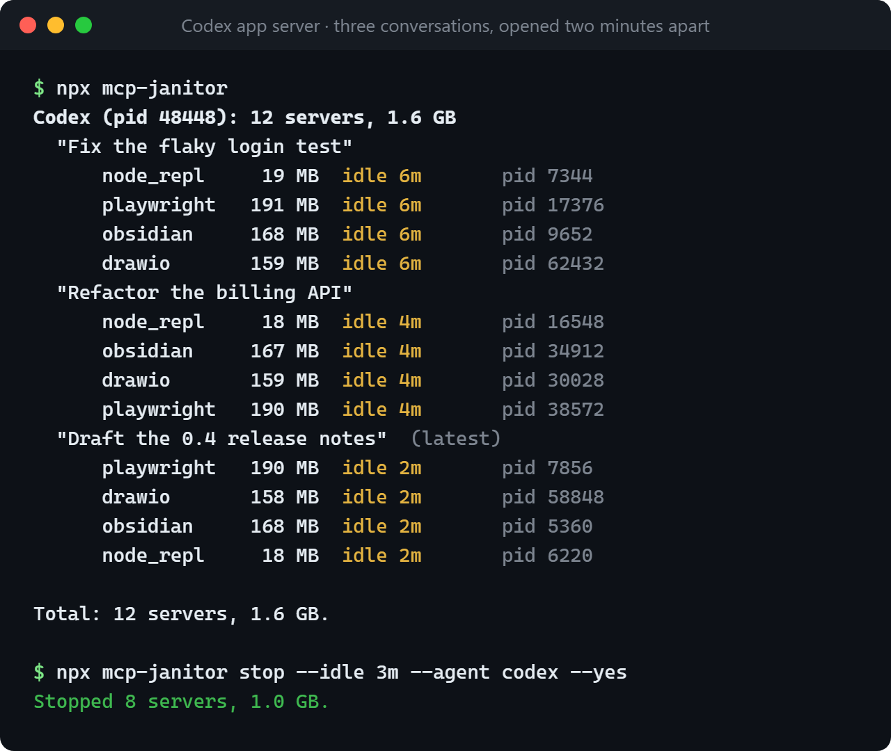

# mcp-janitor

找出並關掉 Codex、ChatGPT 桌面版、Claude Code 等 AI agent 一直開著、閒置或被留下的 MCP server 程序。
Codex 每開一個對話就把你的 MCP server 全部再啟動一份，一直留到 app 關閉為止。
mcp-janitor 告訴你每個屬於哪個對話、閒置多久，再手動關掉，或在閒置太久時自動關。

[](https://github.com/Rober1208/mcp-janitor/actions/workflows/ci.yml)
[](LICENSE)

[English](README.md) · **繁體中文**

CLI、IDE 擴充、ChatGPT 桌面版裡的 Codex 都是這樣，每個對話（thread）一份；Claude Code 也是每個 session 各開一份，
server 還可能在 agent 結束後被留下（孤兒程序）。結果就是 MCP 程序越開越多：
一堆閒置的 `node.exe`、`node_repl.exe`、Playwright 和瀏覽器程序，吃掉好幾 GB 記憶體。
mcp-janitor 支援 Codex、Claude Code、Claude Desktop、Cursor、VS Code 和 Gemini CLI，你正在用的對話不會被動到。

```bash
npx github:Rober1208/mcp-janitor#v0.1.2                  # 列出來
npx github:Rober1208/mcp-janitor#v0.1.2 stop --idle 1h   # 關掉閒置一小時以上的
```

它只負責清理，不會改變 agent 啟動 MCP 的方式。支援 Windows、macOS、Linux（含 WSL），
需要 Node.js 22 以上和 Git；沒有相依套件、不用設定，它直接讀各個 agent 本來就有的 MCP 設定。
要顯示 Codex 的對話名稱需要 Node.js 22.13 以上。mcp-janitor 沒有放在 npm 上，請照上面從 GitHub 執行，
或這樣安裝 `mcp-janitor` 指令：

```bash
npm install -g github:Rober1208/mcp-janitor#v0.1.2
```



<sub>實際執行結果：ChatGPT 桌面版所用的 Codex app server，每隔兩分鐘開一個對話，共三個，全程沒有呼叫模型。
可用 [experiments/demo-codex.mjs](experiments/demo-codex.mjs) 重現。</sub>

## 你遇到的是這個問題嗎？

- 工作管理員或活動監視器裡有一大堆 `node.exe`、`node_repl.exe`，或同一個 Playwright、`npx`、`uv`、Python
  server 開了好幾份，而且每開一個新的 Codex 對話就多一組。
- ChatGPT 桌面版或 Codex 開越久越吃記憶體，只有整個關掉才會降下來。
- Codex 的 thread 關掉或封存了，它的 MCP server 還在跑。
- 關掉 Claude Code 的 session（終端機或 VS Code 分頁）之後，MCP server 還留著。

寫這個工具的那台電腦上，ChatGPT 桌面版累積了 11 份：11 個 Playwright、其他每個也各 11 個，
最多 5.6 GB，全部閒置。上游也有人回報同樣的問題：
[openai/codex#30408](https://github.com/openai/codex/issues/30408)（每個 thread 的 MCP 程序都沒被清掉）、
[#35485](https://github.com/openai/codex/issues/35485)（Windows 上每個 thread 一個 `node_repl.exe`）、
[#38754](https://github.com/openai/codex/issues/38754)，Claude Code 則有過
[anthropics/claude-code#24649](https://github.com/anthropics/claude-code/issues/24649)。

## 用法

```bash
mcp-janitor                    # 依 agent 和對話列出 MCP server
mcp-janitor stop               # 從編號清單挑要關的
mcp-janitor stop 4180 5236     # 關掉這幾個（PID 見清單）
mcp-janitor stop --idle 1h     # 關掉閒置一小時以上的
mcp-janitor stop --orphans     # 關掉 agent 已經結束、被留下來的
mcp-janitor watch --idle 1h    # 持續檢查，閒置滿一小時就關
mcp-janitor doctor             # 檢查它在這台電腦上讀得到哪些資料
```

上面那張圖的文字版：

```text
$ mcp-janitor
Codex (pid 48448): 12 servers, 1.6 GB
  "Fix the flaky login test"
      node_repl     19 MB  idle 6m       pid 7344
      playwright   191 MB  idle 6m       pid 17376
      obsidian     168 MB  idle 6m       pid 9652
      drawio       159 MB  idle 6m       pid 62432
  "Refactor the billing API"
      node_repl     18 MB  idle 4m       pid 16548
      obsidian     167 MB  idle 4m       pid 34912
      drawio       159 MB  idle 4m       pid 30028
      playwright   190 MB  idle 4m       pid 38572
  "Draft the 0.4 release notes"  (latest)
      playwright   190 MB  idle 2m       pid 7856
      drawio       158 MB  idle 2m       pid 58848
      obsidian     168 MB  idle 2m       pid 5360
      node_repl     18 MB  idle 2m       pid 6220

Total: 12 servers, 1.6 GB.

$ mcp-janitor stop --idle 3m --agent codex --yes
Stopped 8 servers, 1.0 GB.
```

用 `--idle` 或 `--orphans` 時，`stop` 會先列出要關的項目並詢問；在腳本裡可加 `--yes` 跳過詢問，
或用 `--dry-run` 只看不關。列表、`stop`、`watch` 都能用 `--server playwright` 縮小範圍，或用 `--agent` 加上
`codex`、`"claude code"`、`"claude desktop"`、`cursor`、`vscode`、`gemini` 其中之一。
關掉一個 server 時，它啟動的所有程序也會一起關，例如 Playwright server 操控的瀏覽器。

**預設不會動到你正在用的對話。** 每個 Codex 程序（ChatGPT app、一個 Codex 終端機、一個 VS Code 視窗）
都會保留你最後用的那個對話的 MCP（清單上標 `(latest)`），即使閒置也一樣，因為你可能隨時回來繼續，
而 Codex 沒辦法重新啟動被關掉的 MCP。Claude Code 可以（在 `/mcp` 重新連線），
所以它的 session 在每個地方（終端機、VS Code、Claude app）只保留你最後用的那一個。
搭配 `--idle` 再加上 `--include-latest` 才會一起關。

### MCP 被關掉之後，對話會怎樣

| Agent | MCP 被關掉之後 |
| --- | --- |
| Codex（CLI、IDE 擴充、ChatGPT 桌面版） | 對話還在，但呼叫那個 MCP 會失敗（"Transport closed"）。開新對話或重開 app 會重新啟動它。 |
| Claude Code | `/mcp` 裡會顯示失敗，可以在那裡重新連線。 |
| Claude Desktop | 重開 app 才會再啟動。 |

### 閒置就自動關

`watch` 每分鐘檢查一次（用 `--every` 調整），並記錄它關了什麼：

```text
$ mcp-janitor watch --idle 1h
Checking MCP servers every 1m. Servers idle for 1h or more will be stopped, except those of the conversations you used last. Ctrl+C to quit.
[15:42] stopped 4 servers, 610 MB: playwright (Codex in ChatGPT app, idle 1h 2m), drawio (Codex in ChatGPT app, idle 1h 2m), ...
```

可以開在一個不關的終端機裡，或放到背景：

```bash
nohup mcp-janitor watch --idle 1h > ~/mcp-janitor.log 2>&1 &   # Linux、macOS
```

```powershell
Start-Process -WindowStyle Minimized mcp-janitor 'watch --idle 1h'   # Windows
```

## 常見問題

**Codex 或 ChatGPT 桌面版一直開 MCP 程序、吃記憶體，要怎麼清掉？** 執行 `mcp-janitor stop --idle 1h`。
它會列出閒置一小時以上的對話的 MCP server，問過你才關。每個 Codex 程序裡你最後用的那個對話會保留。
想讓它一直幫你清，就執行 `mcp-janitor watch --idle 1h`。

**Claude Code 或其他 agent 結束後留下的孤兒 MCP server，要怎麼關？** 執行 `mcp-janitor stop --orphans`。
它會關掉之前檢查時看過、當時還跟著 agent 的 server。只是「看起來」被留下的程序會分開列出，
用 PID 指定就能關，例如 `mcp-janitor stop 4180`。

**為什麼不直接把所有 `node.exe` 都關掉？** 其他程式也會用 Node.js，你正在對話的 agent 本身可能也是；
而且把你正在用的對話的 MCP 關掉，它的工具就壞了。mcp-janitor 只關 agent 依照自己的 MCP 設定直接啟動的程序。

**它會修好 Codex 的這個問題嗎？** 不會。它只負責清理，根本的修正要在上游
[openai/codex#30408](https://github.com/openai/codex/issues/30408)。在那之前，`watch --idle 1h` 可以讓數量維持在低檔。

**它會把資料傳到別的地方嗎？** 不會，見[隱私](#隱私)。

## 給 AI agent 和腳本

這一節說明由 AI agent 或腳本執行、沒有人在終端機前時，mcp-janitor 的行為。

依名稱結束程序（`taskkill /im node.exe`、`pkill node`）會連使用者其他的 Node.js 程式一起關掉，也可能關掉 agent 自己；
mcp-janitor 只關 MCP server。agent 被要求清理時，穩妥的做法是：

1. 列出 server：`npx -y github:Rober1208/mcp-janitor#v0.1.2 --json`
2. 看會關掉哪些，並給使用者看：
   `npx -y github:Rober1208/mcp-janitor#v0.1.2 stop --idle 1h --dry-run`
3. 使用者同意後：把 `--dry-run` 換成 `--yes` 再執行一次；或用 `stop <pid> <pid> --yes` 關掉使用者挑的那幾個。

不加 `--include-latest` 時，最後用的那些對話會保留它們的 server，agent 自己所在的對話可能就在其中。

- 沒有終端機時，`stop --idle` 和 `stop --orphans` 要加 `--yes`，`stop` 要給 PID；否則會以結束碼 2 結束，什麼都不關。
- 結束碼：0 表示照要求完成，包括沒有東西可關；1 表示有 server 關不掉（stderr 會寫是哪個）、
  `doctor` 發現問題，或其他錯誤；2 表示指令用錯，例如給了不在清單上的 PID。
- `stop` 會印出 `Stopped 3 servers, 410 MB.` 或 `Nothing to stop.`。只有列表能用 `--json`；之後再執行一次就知道還剩哪些。
- 閒置時間要看兩次才知道。第一次看到、又對不到對話的 server，`idleMs` 是 `null`，不會因為閒置被關；
  `stop --idle` 會在三秒後再看一次。每次列表、`stop`、`watch` 檢查（包括 `--dry-run`）都會把看到的記在狀態檔裡
  （見[隱私](#隱私)），下次執行就知道得更多。
- 要無人值守地清理，用 `watch --idle 1h` 比每晚跑一次 `stop` 好。先用 `npm install -g` 裝一次，
  不要每次都用 `npx` 從 GitHub 抓，並用和 agent 相同的使用者帳號執行。

`--json` 會輸出一個清單，每個 server 一個物件：

| 欄位 | 意思 |
| --- | --- |
| `name` | 這個 server 在 agent 設定裡的名稱 |
| `agent`、`host` | agent，例如 `"Codex"`；以及它在哪裡執行，例如 `"ChatGPT app"` 或 `"VS Code"`（不知道時是 `null`） |
| `agentPid` | 啟動它的 agent 程序；孤兒是 `null` |
| `pid`、`processes` | server 的 PID，以及它和它啟動的所有程序的 PID |
| `orphan`、`confirmed` | 它的 agent 已經結束；之前檢查時看過它跟著 agent |
| `latest` | 它屬於最後用的那個對話，會被保留 |
| `conversation` | `{ id, title, busy }`，不知道時是 `null` |
| `memoryBytes` | server 和它啟動的程序的工作集 |
| `idleMs`、`measured`、`lastUsed` | 閒置時間（還不知道時是 `null`）、是否和之前的檢查比對過、最後一次被用到的時間 |
| `started` | server 啟動的時間（ISO 8601） |

## 運作方式

**怎麼判斷哪些程序是 MCP server。** mcp-janitor 先讀你替各 agent 設定的 MCP server，
再從你自己的程序裡（多人共用的電腦上，別人的程序不會列入）找由 agent *直接*啟動、指令和它自己設定裡的某一筆逐字相符的程序。agent 替你執行的指令通常會經過 shell，
而 shell 永遠不會被當成 MCP。Codex 還會啟動一些沒寫在設定檔裡的 server，例如插件；
只有和同一個對話的其他 server 在同一瞬間啟動的程序，才會被算成其中之一。

**孤兒程序。** agent 已經結束、被留下來的 server 叫做孤兒（orphan），已經沒有任何東西能跟它溝通。
只有在之前的檢查中看過它跟著 agent 的，mcp-janitor 才確定它是孤兒，也只有這種會被 `--orphans`、`--idle`、`watch` 關掉。
只是「看起來」被留下的程序（跑的是設定裡的 server 指令、父程序已經不在）會分開列出，
只有你親自挑選或指定 PID 時才會關。

**怎麼知道是哪個對話（thread）開的。** Claude Code 會在 `~/.claude/sessions/<pid>.json` 記錄每個程序正在跑的對話。
Codex 的 thread ID 是 UUIDv7，本身帶有建立時間，重新打開舊對話時 Codex 也會寫進 log；
一組 server 屬於在它啟動前一刻建立或重新打開的那個對話。
Claude Desktop 則是所有對話共用同一份 server。

**怎麼算閒置多久。** agent 只會在處理對話的時候呼叫 MCP，所以對話最後一次有動靜之後，
它的 server 不可能再被用到。mcp-janitor 也會在每次檢查之間記錄 server 有沒有用到 CPU 或做 I/O。
閒置時間從兩者中較晚的那個算起，也就是兩邊都沒動靜才算閒置。
server 操控的瀏覽器（Playwright、Puppeteer）在背景的動作不算 server 在忙。
從沒看過、也對不到對話的 server 會顯示 `–`，下次檢查才有數字。
沒有被檢查過兩次的 server 不會因為閒置被關：`stop --idle` 第一次看到某個 server 時，會在三秒後再看一次。

**記憶體。** 顯示的記憶體是 server 和它啟動的所有程序的工作集（常駐記憶體）。
和其他程序共用的記憶體會在每個程序各算一次，所以加總是上限。

**怎麼關。** 送出訊號前，mcp-janitor 會確認那個 PID 仍然是清單上的同一個程序。
它會關掉 server 和 server 啟動的所有程序：Linux 和 macOS 先送 SIGTERM，三秒後還在才送 SIGKILL；Windows 直接結束程序。

## 支援的 Agent

| Agent | 從哪裡讀 MCP 設定 | 對話名稱 |
| --- | --- | --- |
| Codex：CLI、IDE 擴充、ChatGPT 與 Codex 桌面版 | `~/.codex/config.toml`、插件 | 有 |
| Claude Code | `~/.claude.json`、專案的 `.mcp.json`、插件 | 有 |
| Claude Desktop | `claude_desktop_config.json`、擴充 | 所有對話共用 |
| Cursor | `~/.cursor/mcp.json` | 無 |
| VS Code | 使用者設定的 `mcp.json` 和 `settings.json` | 無 |
| Gemini CLI | `~/.gemini/settings.json` | 無 |

其他 agent：把 `MCP_JANITOR_SERVERS` 指向一個 `{ "mcpServers": { ... } }` 格式的 JSON 檔，
再把 `MCP_JANITOR_AGENTS` 設成能比對到該 agent 指令列的正規表示式。

目前實測過：Windows 11 上 ChatGPT 桌面版裡的 Codex，以及 Codex app server 0.160，都是真的 MCP server，
包括 Codex 內建的 `node_repl`；測試套件會在 Windows、Linux、macOS 上跑真實程序。
Cursor、VS Code、Gemini CLI 依官方文件的設定檔位置讀取，但還沒在實際安裝上試過。

對話名稱來自各 agent 自己保存的檔案，agent 改版時這些檔案可能會變。`mcp-janitor doctor` 會逐一檢查每個來源，告訴你哪些讀不到。
如果你的電腦上漏抓或抓錯，歡迎 [開 issue](https://github.com/Rober1208/mcp-janitor/issues)，
附上 `mcp-janitor doctor` 和 `mcp-janitor --json` 的輸出。裡面有你的檔案路徑和對話標題，不想公開的請先換掉。

## 隱私

mcp-janitor 只讀本機檔案和程序清單，不會傳送任何資料。對話標題只會顯示在你的終端機。
為了比較兩次檢查之間的活動，它會存一個小小的狀態檔：Windows 在 `%LOCALAPPDATA%\mcp-janitor`，
macOS 在 `~/Library/Application Support/mcp-janitor`，Linux 在 `~/.local/state/mcp-janitor`。

## 授權

[MIT](LICENSE)
